# System Architecture

**Version:** 1.2.2 | **Last Updated:** 2026-01-13

## High-Level Overview

Nano Banana Slides Prompter follows a client-server architecture with a React SPA frontend and Hono/Bun backend.

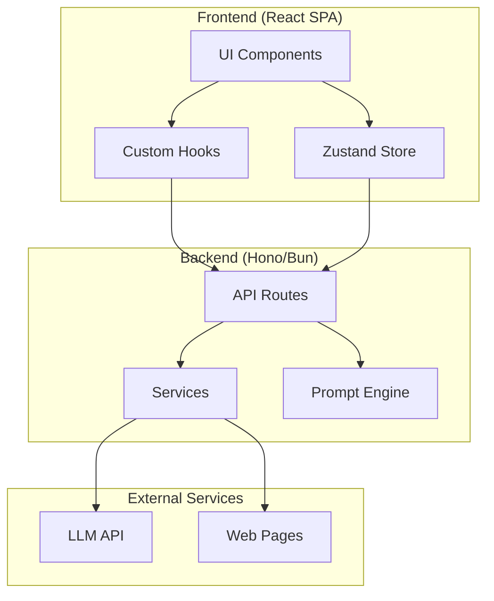

## Frontend Architecture

### Component Hierarchy

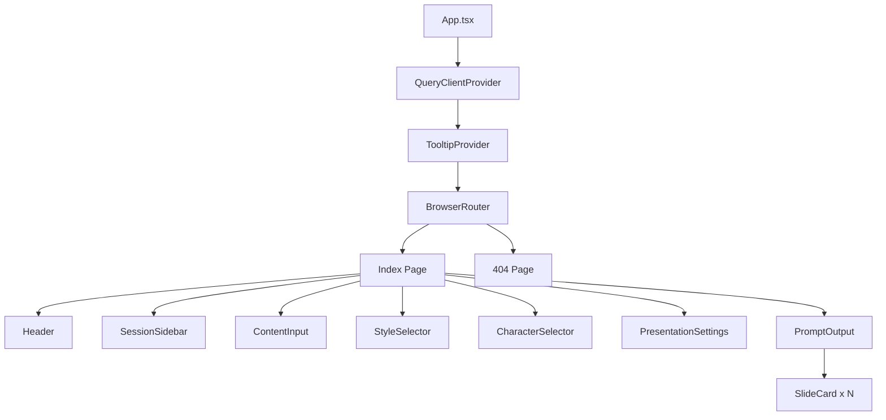

### State Management Flow

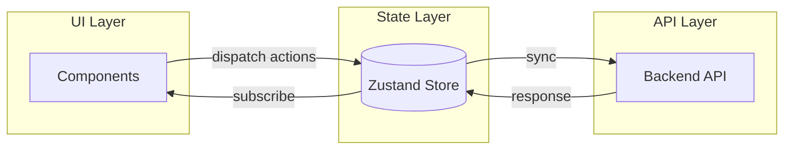

**Zustand Store Structure**:

| State              | Type                           | Purpose                 |
| ------------------ | ------------------------------ | ----------------------- |
| `sessions`         | `Session[]`                    | All user sessions       |
| `currentSessionId` | `string \| null`               | Active session ID       |
| `abortControllers` | `Map<string, AbortController>` | Cancel ongoing requests |
| `isLoading`        | `boolean`                      | Loading state           |
| `syncTimeoutId`    | `number \| null`               | Debounce sync timer     |

### Data Flow: Prompt Generation

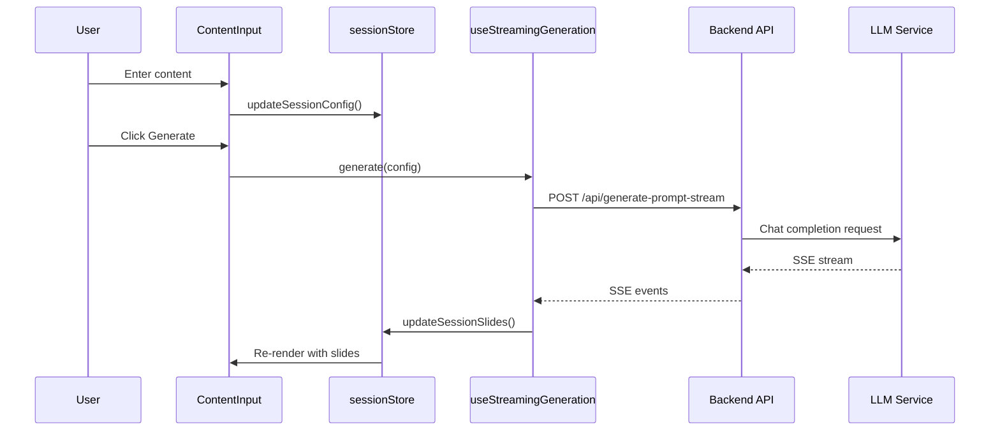

## Backend Architecture

### Request Flow

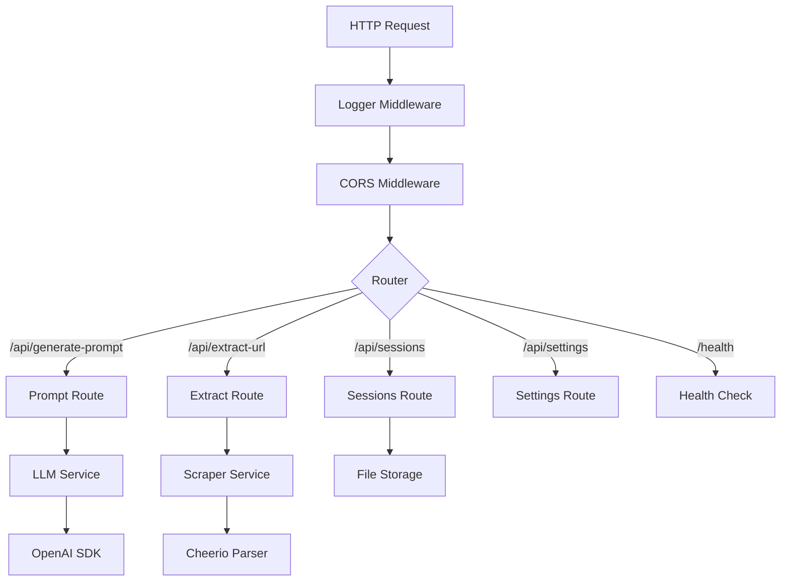

### API Endpoints

| Endpoint                      | Method | Description         | Request                          | Response                         |
| ----------------------------- | ------ | ------------------- | -------------------------------- | -------------------------------- |
| `/health`                     | GET    | Health check        | -                                | `{ status, timestamp, version }` |
| `/api/generate-prompt`        | POST   | Generate prompts    | `SlidePromptConfig`              | `{ slides: ParsedSlide[] }`      |
| `/api/generate-prompt-stream` | POST   | Stream prompts      | `SlidePromptConfig`              | SSE stream                       |
| `/api/extract-url`            | POST   | Extract URL content | `{ url }`                        | `{ title, content }`             |
| `/api/sessions`               | GET    | List sessions       | -                                | `{ sessions, currentSessionId }` |
| `/api/sessions`               | POST   | Create session      | `Session`                        | `{ success, session }`           |
| `/api/sessions/:id`           | PUT    | Update session      | `Partial<Session>`               | `{ success }`                    |
| `/api/sessions/:id`           | DELETE | Delete session      | -                                | `{ success }`                    |
| `/api/sessions/current/:id`   | PUT    | Set current session | -                                | `{ success }`                    |
| `/api/sessions/sync`          | POST   | Bulk sync           | `{ sessions, currentSessionId }` | `{ success }`                    |
| `/api/settings/llm`           | GET    | Get LLM config      | -                                | `{ baseUrl, model }`             |

### Service Layer

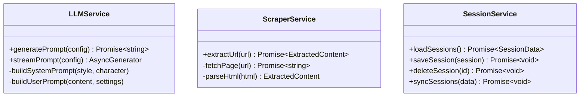

### Prompt Engine

The prompt engine (`server/src/prompts/`) contains:

| Component            | Description                                         |
| -------------------- | --------------------------------------------------- |
| **Visual Styles**    | 20 styles (Professional, Technical, Creative, etc.) |
| **Color Palettes**   | 13 palettes (Auto, Corporate, Vibrant, etc.)        |
| **Character Styles** | 8 render styles (Pixar, Anime, Cartoon, etc.)       |
| **Slide Templates**  | 50+ templates across 10 categories                  |
| **Style Personas**   | Creative identities for each style                  |

**Slide Type Categories**:

| Category    | Templates                                |
| ----------- | ---------------------------------------- |
| Opening     | Title, Hook, Problem Statement           |
| Concept     | Diagram, Metaphor, Breakdown, Ecosystem  |
| Data        | Chart, Dashboard, Trends, Correlation    |
| Process     | Timeline, Flowchart, Flywheel, Journey   |
| Technical   | Architecture, Stack, API, Infrastructure |
| Business    | Strategy, ROI, Market, Roadmap           |
| Comparison  | Side-by-side, Before/After, Matrix       |
| Examples    | Case Study, Testimonial, Demo            |
| Educational | Definition, Example, Quiz                |
| Closing     | Summary, CTA, Q&A                        |

## Data Models

### Session Model

```typescript
interface Session {
  id: string;
  title: string;
  isDefaultTitle: boolean;
  createdAt: number;
  updatedAt: number;
  config: SlidePromptConfig;
  status: SessionStatus;
  slides: ParsedSlide[];
  generatedPrompt: GeneratedPrompt | null;
  error: string | null;
}

type SessionStatus = 'idle' | 'generating' | 'complete' | 'error';
```

### Slide Prompt Config

```typescript
interface SlidePromptConfig {
  content: ContentConfig;
  style: VisualStyle;
  character?: CharacterConfig;
  settings: PresentationSettings;
}

interface ContentConfig {
  type: 'text' | 'url' | 'file';
  text: string;
  topic: string;
  fileContent: string;
  fileName: string;
  url: string;
  urlContent: string;
}

interface PresentationSettings {
  aspectRatio: '16:9' | '4:3' | '1:1';
  slideCount: number;
  colorPalette: ColorPalette;
  layoutStructure: LayoutStructure;
}
```

## Deployment Architecture

### Docker Compose

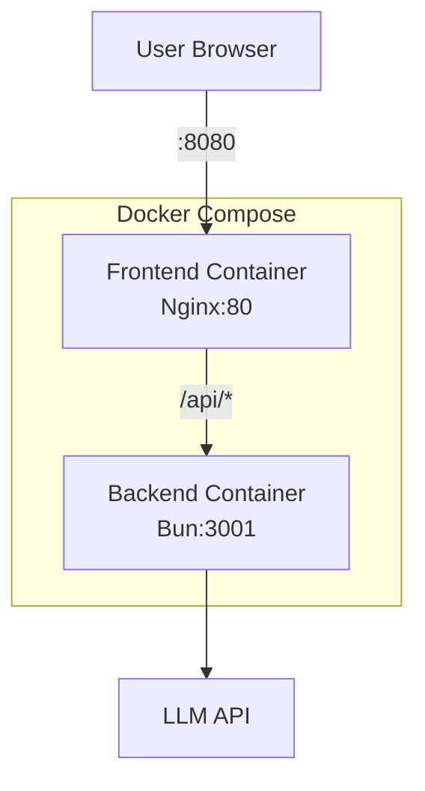

### Container Configuration

| Container | Base Image   | Port                          | Purpose                       |
| --------- | ------------ | ----------------------------- | ----------------------------- |
| frontend  | nginx:alpine | 80 (internal), 8080 (exposed) | Serve static files, proxy API |
| backend   | oven/bun     | 3001                          | API server                    |

### Environment Variables

**Backend** (`server/.env`):

| Variable          | Description      | Default                   |
| ----------------- | ---------------- | ------------------------- |
| `PORT`            | Server port      | 3001                      |
| `OPENAI_API_BASE` | LLM API base URL | https://api.openai.com/v1 |
| `OPENAI_API_KEY`  | API key          | (required)                |
| `OPENAI_MODEL`    | Model name       | gpt-4o                    |

**Frontend** (build-time):

| Variable       | Description     | Default               |
| -------------- | --------------- | --------------------- |
| `VITE_API_URL` | Backend API URL | http://localhost:3001 |

## Security Considerations

| Aspect           | Implementation                  |
| ---------------- | ------------------------------- |
| CORS             | Whitelist specific origins      |
| API Keys         | Server-side only, env variables |
| User Overrides   | Optional client-side storage    |
| Input Validation | Zod schemas on backend          |
| Error Handling   | Sanitized error messages        |

## Performance Optimizations

| Optimization        | Implementation                 |
| ------------------- | ------------------------------ |
| SSE Streaming       | Real-time prompt delivery      |
| Debounced Sync      | 500ms delay for session sync   |
| Optimistic Updates  | UI updates before API response |
| Abort Controllers   | Cancel ongoing requests        |
| Parallel Processing | Character + content analysis   |

## Scalability Considerations

| Aspect          | Current         | Future                |
| --------------- | --------------- | --------------------- |
| Session Storage | File-based JSON | Database (PostgreSQL) |
| Caching         | None            | Redis for prompts     |
| Load Balancing  | Single instance | Nginx/HAProxy         |
| Rate Limiting   | None            | Per-user limits       |

## Testing Infrastructure

### Test Stack

| Tool            | Purpose                        |
| --------------- | ------------------------------ |
| Vitest          | Unit/integration test runner   |
| Testing Library | React component testing        |
| jsdom           | Browser environment simulation |

### Test Configuration

- Config file: `vitest.config.ts`
- Test directory: `src/__tests__/`
- Coverage: V8 provider

### Running Tests

```bash
npm test              # Run all tests
npm run test:coverage # With coverage report
npm run test:watch    # Watch mode
```

## Desktop Application Architecture (Electron)

### Process Model

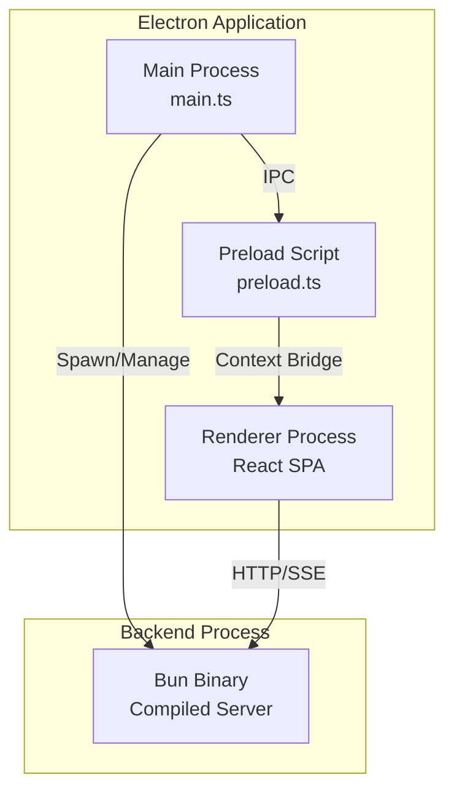

### Component Overview

| Component       | File                             | Responsibility                             |
| --------------- | -------------------------------- | ------------------------------------------ |
| Main Process    | `desktop/src/main.ts`            | Window management, IPC handlers, lifecycle |
| Backend Manager | `desktop/src/backend-manager.ts` | Spawn/stop backend, port discovery         |
| Config Manager  | `desktop/src/config-manager.ts`  | User preferences, persistent settings      |
| Auto Updater    | `desktop/src/auto-updater.ts`    | GitHub releases, download/install updates  |
| Menu            | `desktop/src/menu.ts`            | Application menu (File, Edit, View, Help)  |
| Preload         | `desktop/src/preload.ts`         | Secure IPC bridge to renderer              |

### Backend Process Management

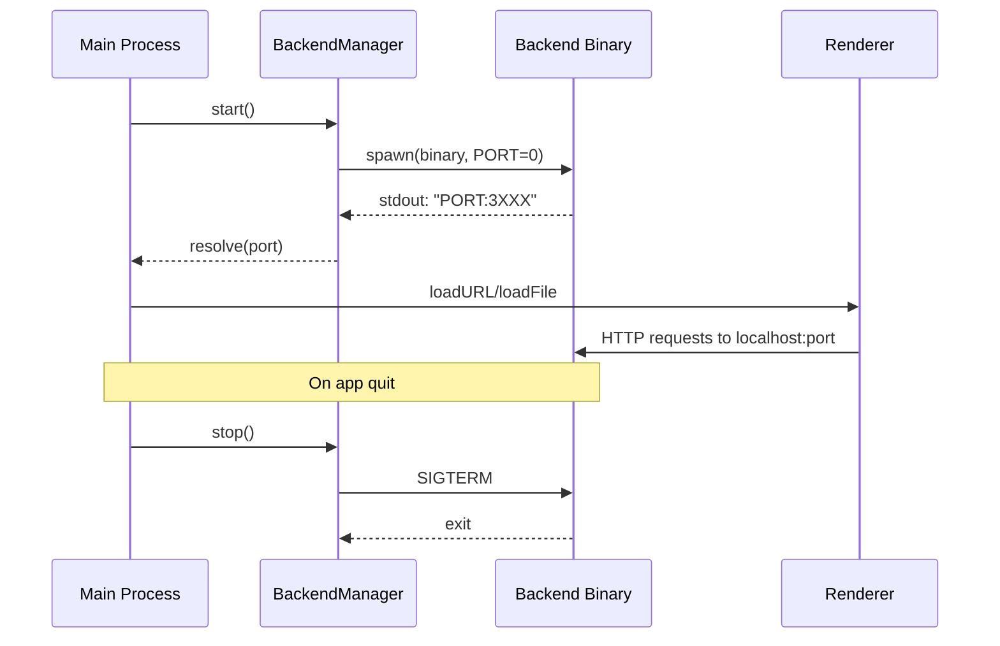

**Key Features**:

- Dynamic port allocation (`PORT=0`)
- Port discovery via stdout parsing (`PORT:XXXXX`)
- Graceful shutdown with SIGTERM, force kill after 5s
- Development mode uses `bun run`, production uses compiled binary

### Auto-Updater Flow

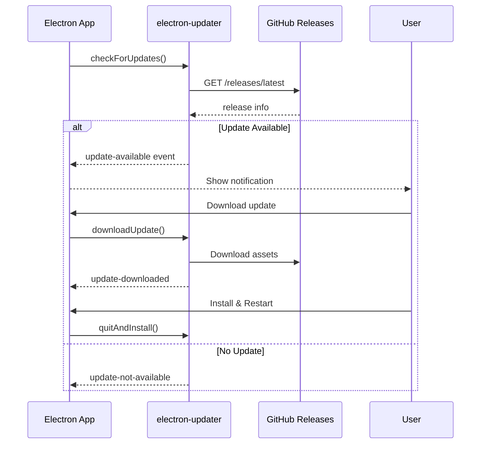

**Update Configuration**:

- Provider: GitHub Releases
- Auto-download: Disabled (user-initiated)
- Auto-install on quit: Enabled
- Check on startup: Configurable via settings

### IPC Communication

| Channel                     | Direction        | Purpose               |
| --------------------------- | ---------------- | --------------------- |
| `get-backend-port`          | Renderer -> Main | Get backend API port  |
| `get-app-version`           | Renderer -> Main | Get app version       |
| `check-for-updates`         | Renderer -> Main | Trigger update check  |
| `download-update`           | Renderer -> Main | Start update download |
| `install-update`            | Renderer -> Main | Install and restart   |
| `update-status`             | Main -> Renderer | Update state changes  |
| `update-progress`           | Main -> Renderer | Download progress %   |
| `get-config` / `set-config` | Bidirectional    | User preferences      |

### Build & Distribution

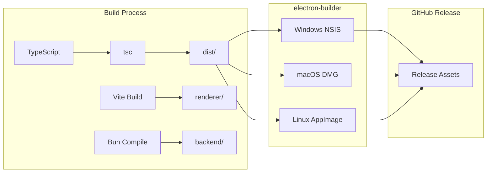

**Build Targets**:

| Platform | Target         | Architectures |
| -------- | -------------- | ------------- |
| Windows  | NSIS installer | x64           |
| macOS    | DMG            | x64, arm64    |
| Linux    | AppImage, deb  | x64           |

### Security Measures

| Measure           | Implementation                    |
| ----------------- | --------------------------------- |
| Context Isolation | `contextIsolation: true`          |
| Node Integration  | `nodeIntegration: false`          |
| Sandbox           | `sandbox: true`                   |
| Window Open       | Denied via `setWindowOpenHandler` |
| External URLs     | Validated (http/https only)       |
| Preload Script    | Minimal IPC bridge exposure       |
