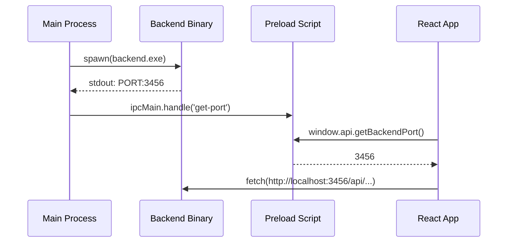

# Phase 1: Electron Shell Setup

## Context

- **Parent Plan:** [plan.md](./plan.md)
- **Research:** [Electron + Bun Integration](./research/researcher-01-electron-bun-integration.md)
- **Dependencies:** None (first phase)

## Overview

| Field | Value |
|-------|-------|
| Date | 2026-01-12 |
| Priority | P1 |
| Effort | 5h |
| Implementation | completed |
| Review | pending |

**Goal:** Create minimal Electron shell that spawns Bun backend and loads React frontend.

## Key Insights

1. Use `bun build --compile` for single executable per platform
2. Dynamic port allocation via port 0, parse `PORT:XXXXX` from stdout
3. Frontend connects to backend via IPC-provided port
4. Graceful shutdown in `app.on('before-quit')`

## Requirements

- [ ] Create `desktop/` directory with Electron project structure
- [ ] Main process spawns compiled Bun backend binary
- [ ] Preload script exposes IPC bridge for port communication
- [ ] Load Vite-built frontend in BrowserWindow
- [ ] Backend manager handles lifecycle (start/stop/restart)

## Architecture



## Related Code Files

| Current File | Purpose |
|--------------|---------|
| `server/src/index.ts` | Backend entry point (needs port 0 support) |
| `src/lib/api.ts` | Frontend API client (needs dynamic port) |
| `package.json` | Root scripts for building |

## Implementation Steps

### Step 1: Create Desktop Directory Structure

```bash
mkdir -p desktop/src desktop/scripts desktop/resources/icons
```

### Step 2: desktop/package.json

```json
{
  "name": "nano-banana-slides-prompter-desktop",
  "version": "1.0.6",
  "main": "dist/main.js",
  "scripts": {
    "dev": "tsc && electron .",
    "build": "tsc && electron-builder",
    "build:backend": "ts-node scripts/build-backend.ts",
    "prebuild": "npm run build:backend"
  },
  "dependencies": {
    "electron-updater": "^6.3.0"
  },
  "devDependencies": {
    "electron": "^33.0.0",
    "electron-builder": "^25.1.0",
    "typescript": "^5.9.3",
    "ts-node": "^10.9.2",
    "@types/node": "^22.0.0"
  }
}
```

### Step 3: desktop/src/main.ts

```typescript
import { app, BrowserWindow, ipcMain } from 'electron';
import path from 'path';
import { BackendManager } from './backend-manager';

let mainWindow: BrowserWindow | null = null;
let backendManager: BackendManager | null = null;

async function createWindow() {
  mainWindow = new BrowserWindow({
    width: 1400,
    height: 900,
    webPreferences: {
      preload: path.join(__dirname, 'preload.js'),
      contextIsolation: true,
      nodeIntegration: false,
    },
  });

  // Start backend and get port
  backendManager = new BackendManager();
  const port = await backendManager.start();

  // Expose port to renderer
  ipcMain.handle('get-backend-port', () => port);

  // Load frontend
  if (app.isPackaged) {
    mainWindow.loadFile(path.join(__dirname, '../renderer/index.html'));
  } else {
    mainWindow.loadURL('http://localhost:8080');
    mainWindow.webContents.openDevTools();
  }
}

app.whenReady().then(createWindow);

app.on('window-all-closed', () => {
  if (process.platform !== 'darwin') app.quit();
});

app.on('before-quit', () => {
  backendManager?.stop();
});

app.on('activate', () => {
  if (BrowserWindow.getAllWindows().length === 0) createWindow();
});
```

### Step 4: desktop/src/backend-manager.ts

```typescript
import { spawn, ChildProcess } from 'child_process';
import path from 'path';
import { app } from 'electron';

export class BackendManager {
  private process: ChildProcess | null = null;
  private port: number | null = null;

  private getBinaryPath(): string {
    const ext = process.platform === 'win32' ? '.exe' : '';
    const binaryName = `backend${ext}`;

    if (app.isPackaged) {
      return path.join(process.resourcesPath, 'bin', binaryName);
    }
    // Dev mode: use compiled binary in desktop/bin
    return path.join(__dirname, '..', 'bin', process.platform, binaryName);
  }

  start(): Promise<number> {
    return new Promise((resolve, reject) => {
      const binaryPath = this.getBinaryPath();

      this.process = spawn(binaryPath, [], {
        stdio: ['pipe', 'pipe', 'pipe'],
        env: { ...process.env, PORT: '0' },
      });

      const timeout = setTimeout(() => {
        reject(new Error('Backend startup timeout'));
      }, 10000);

      this.process.stdout?.on('data', (data: Buffer) => {
        const output = data.toString();
        console.log('[Backend]', output);

        const match = output.match(/PORT:(\d+)/);
        if (match) {
          this.port = parseInt(match[1], 10);
          clearTimeout(timeout);
          resolve(this.port);
        }
      });

      this.process.stderr?.on('data', (data: Buffer) => {
        console.error('[Backend Error]', data.toString());
      });

      this.process.on('error', (err) => {
        clearTimeout(timeout);
        reject(err);
      });

      this.process.on('exit', (code) => {
        console.log(`Backend exited with code ${code}`);
        this.process = null;
      });
    });
  }

  stop(): void {
    if (this.process) {
      this.process.kill('SIGTERM');
      this.process = null;
    }
  }

  getPort(): number | null {
    return this.port;
  }
}
```

### Step 5: desktop/src/preload.ts

```typescript
import { contextBridge, ipcRenderer } from 'electron';

contextBridge.exposeInMainWorld('electronAPI', {
  getBackendPort: () => ipcRenderer.invoke('get-backend-port'),
  onBackendReady: (callback: (port: number) => void) => {
    ipcRenderer.on('backend-ready', (_, port) => callback(port));
  },
});
```

### Step 6: Update server/src/index.ts (port output)

```typescript
// Add after server starts
const port = Number(process.env.PORT) || 3001;
console.log(`Starting server on port ${port}...`);

// Add this line for Electron IPC
console.log(`PORT:${port}`);

export default {
  port,
  fetch: app.fetch,
  idleTimeout: 255,
};
```

### Step 7: Update src/lib/api.ts (dynamic port)

```typescript
// Add at top of file
declare global {
  interface Window {
    electronAPI?: {
      getBackendPort: () => Promise<number>;
    };
  }
}

let cachedBaseUrl: string | null = null;

async function getBaseUrl(): Promise<string> {
  if (cachedBaseUrl) return cachedBaseUrl;

  if (window.electronAPI) {
    const port = await window.electronAPI.getBackendPort();
    cachedBaseUrl = `http://localhost:${port}`;
  } else {
    cachedBaseUrl = 'http://localhost:3001';
  }
  return cachedBaseUrl;
}

// Update all fetch calls to use: const baseUrl = await getBaseUrl();
```

### Step 8: desktop/scripts/build-backend.ts

```typescript
import { execSync } from 'child_process';
import fs from 'fs';
import path from 'path';

const platforms = [
  { target: 'bun-windows-x64', output: 'win/backend.exe' },
  { target: 'bun-darwin-arm64', output: 'darwin/backend' },
  { target: 'bun-darwin-x64', output: 'darwin-x64/backend' },
  { target: 'bun-linux-x64', output: 'linux/backend' },
];

const serverEntry = path.resolve(__dirname, '../../server/src/index.ts');
const binDir = path.resolve(__dirname, '../bin');

// Ensure bin directories exist
platforms.forEach(({ output }) => {
  const dir = path.dirname(path.join(binDir, output));
  fs.mkdirSync(dir, { recursive: true });
});

// Build for current platform only in dev, all platforms in CI
const currentPlatform = process.env.BUILD_ALL_PLATFORMS
  ? platforms
  : platforms.filter(p => {
      if (process.platform === 'win32') return p.target.includes('windows');
      if (process.platform === 'darwin') return p.target.includes('darwin');
      return p.target.includes('linux');
    });

currentPlatform.forEach(({ target, output }) => {
  console.log(`Building backend for ${target}...`);
  const outPath = path.join(binDir, output);
  execSync(`bun build ${serverEntry} --compile --target=${target} --outfile=${outPath}`, {
    stdio: 'inherit',
  });
});

console.log('Backend builds complete!');
```

### Step 9: desktop/electron-builder.yml

```yaml
appId: com.nomie7.nano-banana-slides-prompter
productName: Nano Banana Slides Prompter
copyright: Copyright © 2026 Nomie7

directories:
  output: release
  buildResources: resources

files:
  - dist/**/*
  - renderer/**/*

extraResources:
  - from: bin/${os}
    to: bin
    filter:
      - "**/*"

mac:
  target:
    - target: dmg
      arch: [arm64, x64]
    - target: zip
      arch: [arm64, x64]
  category: public.app-category.productivity
  identity: null  # Skip signing for dev

win:
  target:
    - target: nsis
      arch: [x64]
  artifactName: ${productName}-Setup-${version}.${ext}

linux:
  target:
    - AppImage
    - deb
  category: Utility

nsis:
  oneClick: false
  allowToChangeInstallationDirectory: true
  createDesktopShortcut: true

publish:
  provider: github
  owner: nomie7
  repo: nano-banana-slides-prompter
```

### Step 10: desktop/tsconfig.json

```json
{
  "compilerOptions": {
    "target": "ES2022",
    "module": "commonjs",
    "lib": ["ES2022"],
    "outDir": "dist",
    "rootDir": "src",
    "strict": true,
    "esModuleInterop": true,
    "skipLibCheck": true,
    "forceConsistentCasingInFileNames": true,
    "resolveJsonModule": true,
    "declaration": true
  },
  "include": ["src/**/*"],
  "exclude": ["node_modules", "dist", "bin"]
}
```

## Todo List

- [x] Create `desktop/` directory structure
- [x] Create `desktop/package.json` with Electron dependencies
- [x] Implement `desktop/src/main.ts` (main process)
- [x] Implement `desktop/src/preload.ts` (IPC bridge)
- [x] Implement `desktop/src/backend-manager.ts` (spawn/manage backend)
- [x] Create `desktop/electron-builder.yml` (build config)
- [x] Create `desktop/scripts/build-backend.ts` (compile Bun binaries)
- [x] Update `server/src/index.ts` to output PORT for IPC
- [x] Update `src/lib/api.ts` for dynamic port discovery
- [x] Add root scripts to build frontend for desktop
- [ ] Test dev mode: frontend + backend + Electron
- [ ] Test packaged app on Windows

## Success Criteria

- [ ] `npm run dev` in desktop/ launches app with working UI
- [ ] Backend process starts, port communicated via IPC
- [ ] All API calls work (prompt generation, URL extraction)
- [ ] SSE streaming works for prompt generation
- [ ] App window loads with correct dimensions and title
- [ ] Graceful shutdown kills backend process

## Risk Assessment

| Risk | Impact | Mitigation |
|------|--------|------------|
| Bun binary fails to start | High | Add detailed error logging, fallback to bundled Node.js |
| Port parsing fails | Medium | Timeout with clear error message, retry mechanism |
| Large binary size | Low | Bun compile creates ~50MB binary, acceptable |
| Antivirus false positive | Medium | Document user bypass, consider code signing later |

## Security Considerations

1. **contextIsolation: true** - Prevents renderer from accessing Node.js
2. **nodeIntegration: false** - No direct Node.js in renderer
3. **IPC validation** - Only expose minimal API surface
4. **No remote module** - Deprecated and insecure
5. **CSP headers** - Add Content-Security-Policy in production

## Next Steps

After completing Phase 1:
1. Test on all three platforms locally
2. Proceed to Phase 2: CI/CD Build Pipeline
3. Create app icons before Phase 3
