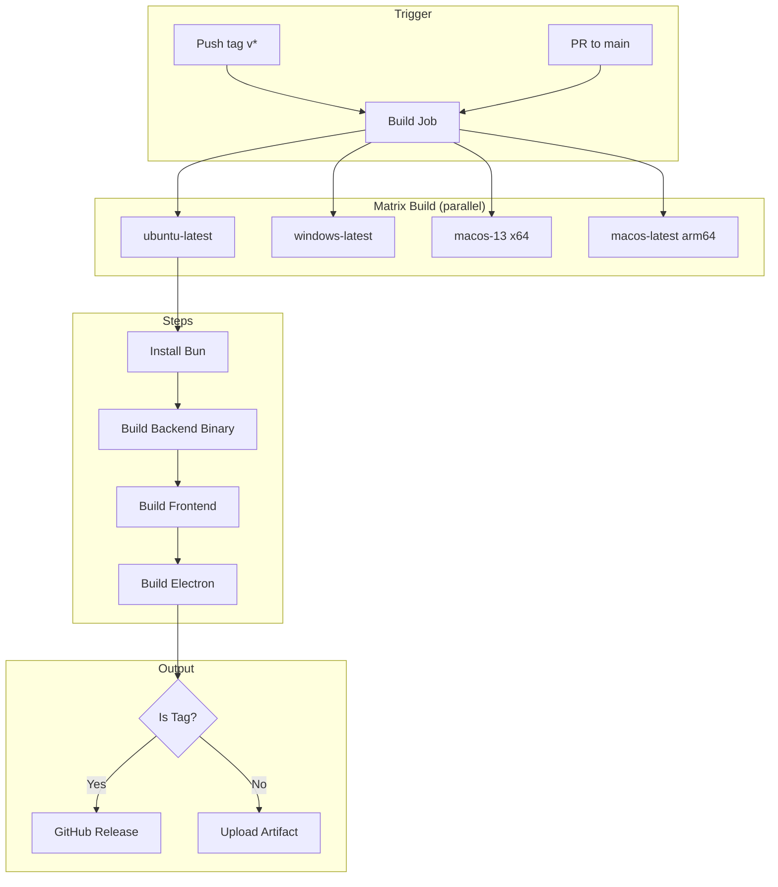

# Phase 2: CI/CD Build Pipeline

## Context

- **Parent Plan:** [plan.md](./plan.md)
- **Research:** [GitHub Actions for Electron](./research/researcher-02-github-actions-electron.md)
- **Dependencies:** Phase 1 (Electron Shell Setup)

## Overview

| Field | Value |
|-------|-------|
| Date | 2026-01-12 |
| Priority | P1 |
| Effort | 4h |
| Implementation | completed |
| Review | pending |

**Goal:** Create GitHub Actions workflow for cross-platform Electron builds with artifact upload and GitHub Releases.

## Key Insights

1. Use matrix strategy for parallel Win/Mac/Linux builds
2. macOS: `macos-13` (Intel x64) + `macos-latest` (ARM64)
3. Cache electron + electron-builder directories for speed
4. Tag-based releases, PR builds upload artifacts only
5. Use `DarkGuy10/action-electron-builder@v1` for simplified workflow

## Requirements

- [ ] Create `.github/workflows/electron-build.yml`
- [ ] Matrix builds for Windows, macOS (x64 + ARM64), Linux
- [ ] Cache npm, electron, and electron-builder
- [ ] Upload artifacts for PR builds
- [ ] Create GitHub Release on version tags
- [ ] Build Bun backend binaries in CI

## Architecture



## Related Code Files

| File | Purpose |
|------|---------|
| `.github/workflows/docker-publish.yml` | Existing Docker CI (reference) |
| `desktop/package.json` | Electron build scripts |
| `desktop/electron-builder.yml` | Build configuration |

## Implementation Steps

### Step 1: .github/workflows/electron-build.yml

```yaml
name: Build Electron App

on:
  push:
    tags: ['v*']
    branches: [main]
  pull_request:
    branches: [main]
  workflow_dispatch:

env:
  NODE_VERSION: '20'

jobs:
  build:
    runs-on: ${{ matrix.os }}
    strategy:
      fail-fast: false
      matrix:
        include:
          - os: ubuntu-latest
            platform: linux
            bun-target: bun-linux-x64
          - os: windows-latest
            platform: win
            bun-target: bun-windows-x64
          - os: macos-13
            platform: mac
            arch: x64
            bun-target: bun-darwin-x64
          - os: macos-latest
            platform: mac
            arch: arm64
            bun-target: bun-darwin-arm64

    steps:
      - name: Checkout
        uses: actions/checkout@v4

      - name: Setup Node.js
        uses: actions/setup-node@v4
        with:
          node-version: ${{ env.NODE_VERSION }}
          cache: 'npm'

      - name: Setup Bun
        uses: oven-sh/setup-bun@v2
        with:
          bun-version: latest

      - name: Cache Electron
        uses: actions/cache@v4
        with:
          path: |
            ~/.cache/electron
            ~/Library/Caches/electron
            ~/AppData/Local/electron/Cache
          key: ${{ runner.os }}-electron-${{ hashFiles('desktop/package-lock.json') }}
          restore-keys: ${{ runner.os }}-electron-

      - name: Cache Electron-Builder
        uses: actions/cache@v4
        with:
          path: |
            ~/.cache/electron-builder
            ~/Library/Caches/electron-builder
            ~/AppData/Local/electron-builder/Cache
          key: ${{ runner.os }}-electron-builder-${{ hashFiles('desktop/package-lock.json') }}
          restore-keys: ${{ runner.os }}-electron-builder-

      - name: Install root dependencies
        run: npm ci

      - name: Install server dependencies
        run: cd server && bun install

      - name: Install desktop dependencies
        run: cd desktop && npm ci

      - name: Build frontend
        run: npm run build

      - name: Copy frontend to desktop
        run: |
          mkdir -p desktop/renderer
          cp -r dist/* desktop/renderer/
        shell: bash

      - name: Build backend binary
        run: |
          mkdir -p desktop/bin/${{ matrix.platform }}
          bun build server/src/index.ts --compile --target=${{ matrix.bun-target }} --outfile=desktop/bin/${{ matrix.platform }}/backend${{ matrix.platform == 'win' && '.exe' || '' }}
        shell: bash

      - name: Build Electron app
        uses: DarkGuy10/action-electron-builder@v1
        with:
          package_root: desktop
          github_token: ${{ secrets.GITHUB_TOKEN }}
          release: ${{ startsWith(github.ref, 'refs/tags/v') }}
          mac_certs: ${{ secrets.MAC_CERTS }}
          mac_certs_password: ${{ secrets.MAC_CERTS_PASSWORD }}
        env:
          EP_DRAFT: ${{ !startsWith(github.ref, 'refs/tags/v') }}

      - name: Upload artifacts
        uses: actions/upload-artifact@v4
        if: ${{ !startsWith(github.ref, 'refs/tags/') }}
        with:
          name: electron-${{ matrix.platform }}-${{ matrix.arch || 'x64' }}
          path: |
            desktop/release/*.exe
            desktop/release/*.dmg
            desktop/release/*.zip
            desktop/release/*.AppImage
            desktop/release/*.deb
          retention-days: 7
          if-no-files-found: ignore
```

### Step 2: Update Root package.json Scripts

Add to root `package.json`:

```json
{
  "scripts": {
    "build:desktop": "npm run build && npm run build:desktop:copy",
    "build:desktop:copy": "mkdir -p desktop/renderer && cp -r dist/* desktop/renderer/",
    "electron:dev": "npm run build:dev && npm run build:desktop:copy && cd desktop && npm run dev"
  }
}
```

### Step 3: Platform-Specific Backend Binary Mapping

Update `desktop/electron-builder.yml` extraResources:

```yaml
extraResources:
  - from: bin/${os}
    to: bin
    filter:
      - "**/*"
```

Platform variable mapping:
- `${os}` = `win` on Windows
- `${os}` = `mac` on macOS
- `${os}` = `linux` on Linux

### Step 4: Conditional macOS Architecture

For macOS universal builds, update workflow:

```yaml
- name: Build Electron app (macOS arm64)
  if: matrix.arch == 'arm64'
  run: cd desktop && npm run build -- --arm64

- name: Build Electron app (macOS x64)
  if: matrix.arch == 'x64'
  run: cd desktop && npm run build -- --x64
```

### Step 5: Release Notes Template

Create `.github/release-template.md`:

```markdown
## What's New

<!-- Release notes here -->

## Downloads

| Platform | File |
|----------|------|
| Windows | `Nano-Banana-Slides-Prompter-Setup-{version}.exe` |
| macOS (Apple Silicon) | `Nano-Banana-Slides-Prompter-{version}-arm64.dmg` |
| macOS (Intel) | `Nano-Banana-Slides-Prompter-{version}-x64.dmg` |
| Linux | `Nano-Banana-Slides-Prompter-{version}.AppImage` |

## Installation Notes

### Windows
SmartScreen may show warning. Click "More info" → "Run anyway".

### macOS
Gatekeeper may block unsigned app. Go to System Settings → Privacy & Security → "Open Anyway".

### Linux
```bash
chmod +x Nano-Banana-Slides-Prompter-*.AppImage
./Nano-Banana-Slides-Prompter-*.AppImage
```

May require `libfuse2` on some distributions.
```

### Step 6: Workflow Dispatch for Manual Builds

Already included in workflow triggers:

```yaml
on:
  workflow_dispatch:  # Manual trigger from GitHub UI
```

## Todo List

- [x] Create `.github/workflows/electron-build.yml`
- [x] Add caching for electron and electron-builder
- [x] Configure matrix for all platforms
- [x] Setup Bun installation in CI
- [x] Build backend binaries per platform
- [x] Copy frontend dist to desktop/renderer
- [x] Configure artifact upload for PR builds
- [x] Configure GitHub Release for tag pushes
- [x] Update root package.json with desktop scripts
- [x] Create release notes template
- [ ] Test workflow on all platforms

## Success Criteria

- [ ] Workflow runs on push to main and PRs
- [ ] All 4 matrix jobs complete (linux, win, mac-x64, mac-arm64)
- [ ] Artifacts downloadable from PR builds
- [ ] Tag push creates GitHub Release with all binaries
- [ ] Build time < 15 minutes per platform (with caching)
- [ ] Caching works correctly, reduces subsequent build times

## Risk Assessment

| Risk | Impact | Mitigation |
|------|--------|------------|
| Bun build fails on CI | High | Test locally first, pin Bun version |
| macOS runners unavailable | Medium | Use `macos-13` fallback for x64 |
| Large artifact size | Low | Use retention-days: 7, compress artifacts |
| GitHub Actions minutes | Medium | Cache aggressively, only build on relevant changes |

## Security Considerations

1. **GITHUB_TOKEN** - Auto-provided, limited to repo scope
2. **MAC_CERTS secrets** - Only needed for signed builds (empty for unsigned)
3. **No hardcoded secrets** - All sensitive data via GitHub Secrets
4. **Draft releases** - Non-tag builds create drafts, not public

## Next Steps

After completing Phase 2:
1. Trigger test build via workflow_dispatch
2. Download and test artifacts on each platform
3. Create first tag (v1.1.0-desktop.1) for release test
4. Proceed to Phase 3: Polish & Production
