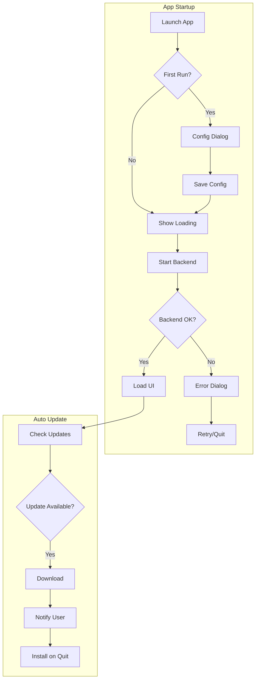

# Phase 3: Polish & Production Readiness

## Context

- **Parent Plan:** [plan.md](./plan.md)
- **Dependencies:** Phase 1 (Electron Shell), Phase 2 (CI/CD Pipeline)

## Overview

| Field | Value |
|-------|-------|
| Date | 2026-01-12 |
| Priority | P2 |
| Effort | 3h |
| Implementation | completed |
| Review | pending |

**Goal:** Add production polish including app icons, auto-updater, error handling, and first-run experience.

## Key Insights

1. Icons needed: .icns (macOS), .ico (Windows), .png (Linux, various sizes)
2. electron-updater checks GitHub Releases for updates
3. First-run needs LLM configuration (API key, base URL)
4. Graceful error handling prevents silent failures

## Requirements

- [ ] Create app icons for all platforms
- [ ] Integrate electron-updater for auto-updates
- [ ] Add first-run configuration flow
- [ ] Implement graceful error handling with user feedback
- [ ] Add loading state while backend starts
- [ ] Configure app menu with standard items

## Architecture



## Related Code Files

| File | Purpose |
|------|---------|
| `desktop/src/main.ts` | Add updater, menu, error handling |
| `desktop/src/preload.ts` | Expose config API |
| `desktop/resources/icons/` | App icons |

## Implementation Steps

### Step 1: Create App Icons

Required files in `desktop/resources/icons/`:

| File | Platform | Size |
|------|----------|------|
| `icon.icns` | macOS | Multi-resolution (16-1024px) |
| `icon.ico` | Windows | Multi-resolution (16-256px) |
| `icon.png` | Linux | 512x512 or 1024x1024 |
| `256x256.png` | Linux | 256x256 |

**Icon generation script** (`desktop/scripts/generate-icons.ts`):

```typescript
// Use electron-icon-maker or sharp to generate from source PNG
import { execSync } from 'child_process';

// Requires: npm install -g electron-icon-maker
// Usage: electron-icon-maker --input=icon-source.png --output=./resources/icons
console.log('Generate icons using electron-icon-maker CLI');
console.log('npx electron-icon-maker --input=icon-source.png --output=./resources/icons');
```

### Step 2: Auto-Updater Integration

Update `desktop/src/main.ts`:

```typescript
import { autoUpdater } from 'electron-updater';
import log from 'electron-log';

// Configure logging
autoUpdater.logger = log;
log.transports.file.level = 'info';

// Disable auto-download, let user decide
autoUpdater.autoDownload = false;
autoUpdater.autoInstallOnAppQuit = true;

function setupAutoUpdater() {
  autoUpdater.on('checking-for-update', () => {
    log.info('Checking for updates...');
  });

  autoUpdater.on('update-available', (info) => {
    log.info('Update available:', info.version);

    // Notify renderer
    mainWindow?.webContents.send('update-available', {
      version: info.version,
      releaseNotes: info.releaseNotes,
    });
  });

  autoUpdater.on('update-not-available', () => {
    log.info('No updates available');
  });

  autoUpdater.on('download-progress', (progress) => {
    mainWindow?.webContents.send('update-progress', progress.percent);
  });

  autoUpdater.on('update-downloaded', (info) => {
    log.info('Update downloaded:', info.version);
    mainWindow?.webContents.send('update-downloaded', info.version);
  });

  autoUpdater.on('error', (err) => {
    log.error('Auto-updater error:', err);
  });

  // Check for updates after window ready
  autoUpdater.checkForUpdates();
}

// IPC handlers for update actions
ipcMain.handle('download-update', () => {
  autoUpdater.downloadUpdate();
});

ipcMain.handle('install-update', () => {
  autoUpdater.quitAndInstall();
});
```

### Step 3: Update Preload for Auto-Updater

Add to `desktop/src/preload.ts`:

```typescript
contextBridge.exposeInMainWorld('electronAPI', {
  // Existing
  getBackendPort: () => ipcRenderer.invoke('get-backend-port'),

  // Auto-updater
  onUpdateAvailable: (callback: (info: { version: string }) => void) => {
    ipcRenderer.on('update-available', (_, info) => callback(info));
  },
  onUpdateProgress: (callback: (percent: number) => void) => {
    ipcRenderer.on('update-progress', (_, percent) => callback(percent));
  },
  onUpdateDownloaded: (callback: (version: string) => void) => {
    ipcRenderer.on('update-downloaded', (_, version) => callback(version));
  },
  downloadUpdate: () => ipcRenderer.invoke('download-update'),
  installUpdate: () => ipcRenderer.invoke('install-update'),

  // Config
  getConfig: () => ipcRenderer.invoke('get-config'),
  setConfig: (config: AppConfig) => ipcRenderer.invoke('set-config', config),
  isFirstRun: () => ipcRenderer.invoke('is-first-run'),
});
```

### Step 4: First-Run Configuration

Create `desktop/src/config-manager.ts`:

```typescript
import { app, ipcMain } from 'electron';
import fs from 'fs';
import path from 'path';

export interface AppConfig {
  llm: {
    apiBase: string;
    apiKey: string;
    model: string;
  };
  firstRunComplete: boolean;
}

const defaultConfig: AppConfig = {
  llm: {
    apiBase: 'https://api.openai.com/v1',
    apiKey: '',
    model: 'gpt-4o',
  },
  firstRunComplete: false,
};

class ConfigManager {
  private configPath: string;
  private config: AppConfig;

  constructor() {
    this.configPath = path.join(app.getPath('userData'), 'config.json');
    this.config = this.load();
  }

  private load(): AppConfig {
    try {
      if (fs.existsSync(this.configPath)) {
        const data = fs.readFileSync(this.configPath, 'utf-8');
        return { ...defaultConfig, ...JSON.parse(data) };
      }
    } catch (err) {
      console.error('Failed to load config:', err);
    }
    return { ...defaultConfig };
  }

  save(): void {
    try {
      fs.writeFileSync(this.configPath, JSON.stringify(this.config, null, 2));
    } catch (err) {
      console.error('Failed to save config:', err);
    }
  }

  get(): AppConfig {
    return this.config;
  }

  set(config: Partial<AppConfig>): void {
    this.config = { ...this.config, ...config };
    this.save();
  }

  isFirstRun(): boolean {
    return !this.config.firstRunComplete;
  }

  markFirstRunComplete(): void {
    this.config.firstRunComplete = true;
    this.save();
  }
}

export const configManager = new ConfigManager();

// Register IPC handlers
export function setupConfigIPC(): void {
  ipcMain.handle('get-config', () => configManager.get());
  ipcMain.handle('set-config', (_, config) => {
    configManager.set(config);
    return true;
  });
  ipcMain.handle('is-first-run', () => configManager.isFirstRun());
}
```

### Step 5: Loading Screen Component

Create React component for loading state (`src/components/ElectronLoading.tsx`):

```tsx
import { useEffect, useState } from 'react';

export function ElectronLoading() {
  const [status, setStatus] = useState('Starting backend...');
  const [error, setError] = useState<string | null>(null);

  useEffect(() => {
    if (!window.electronAPI) return;

    const init = async () => {
      try {
        const port = await window.electronAPI.getBackendPort();
        setStatus(`Backend ready on port ${port}`);
      } catch (err) {
        setError('Failed to start backend. Please restart the app.');
      }
    };

    init();
  }, []);

  if (error) {
    return (
      <div className="flex h-screen items-center justify-center bg-background">
        <div className="text-center">
          <p className="text-destructive mb-4">{error}</p>
          <button
            onClick={() => window.location.reload()}
            className="px-4 py-2 bg-primary text-primary-foreground rounded"
          >
            Retry
          </button>
        </div>
      </div>
    );
  }

  return (
    <div className="flex h-screen items-center justify-center bg-background">
      <div className="text-center">
        <div className="animate-spin h-8 w-8 border-4 border-primary border-t-transparent rounded-full mx-auto mb-4" />
        <p className="text-muted-foreground">{status}</p>
      </div>
    </div>
  );
}
```

### Step 6: Application Menu

Add to `desktop/src/main.ts`:

```typescript
import { Menu, shell } from 'electron';

function createMenu() {
  const template: Electron.MenuItemConstructorOptions[] = [
    {
      label: app.name,
      submenu: [
        { role: 'about' },
        { type: 'separator' },
        {
          label: 'Check for Updates...',
          click: () => autoUpdater.checkForUpdates(),
        },
        { type: 'separator' },
        { role: 'hide' },
        { role: 'hideOthers' },
        { role: 'unhide' },
        { type: 'separator' },
        { role: 'quit' },
      ],
    },
    {
      label: 'Edit',
      submenu: [
        { role: 'undo' },
        { role: 'redo' },
        { type: 'separator' },
        { role: 'cut' },
        { role: 'copy' },
        { role: 'paste' },
        { role: 'selectAll' },
      ],
    },
    {
      label: 'View',
      submenu: [
        { role: 'reload' },
        { role: 'forceReload' },
        { role: 'toggleDevTools' },
        { type: 'separator' },
        { role: 'resetZoom' },
        { role: 'zoomIn' },
        { role: 'zoomOut' },
        { type: 'separator' },
        { role: 'togglefullscreen' },
      ],
    },
    {
      label: 'Help',
      submenu: [
        {
          label: 'Documentation',
          click: () => shell.openExternal('https://github.com/nomie7/nano-banana-slides-prompter'),
        },
        {
          label: 'Report Issue',
          click: () => shell.openExternal('https://github.com/nomie7/nano-banana-slides-prompter/issues'),
        },
      ],
    },
  ];

  const menu = Menu.buildFromTemplate(template);
  Menu.setApplicationMenu(menu);
}
```

### Step 7: Error Dialog for Backend Failures

Update `desktop/src/backend-manager.ts`:

```typescript
import { dialog } from 'electron';

// In BackendManager.start()
this.process.on('error', (err) => {
  clearTimeout(timeout);

  dialog.showErrorBox(
    'Backend Error',
    `Failed to start backend server:\n\n${err.message}\n\nPlease try restarting the application.`
  );

  reject(err);
});

// Add health check
async healthCheck(): Promise<boolean> {
  if (!this.port) return false;

  try {
    const response = await fetch(`http://localhost:${this.port}/health`);
    return response.ok;
  } catch {
    return false;
  }
}
```

### Step 8: Update electron-builder.yml for Icons

```yaml
# Add to electron-builder.yml
mac:
  icon: resources/icons/icon.icns
  # ... existing config

win:
  icon: resources/icons/icon.ico
  # ... existing config

linux:
  icon: resources/icons
  # ... existing config
```

## Todo List

- [ ] Create source icon (1024x1024 PNG)
- [ ] Generate platform-specific icons (.icns, .ico, .png)
- [x] Implement auto-updater in main process
- [x] Add update IPC handlers in preload
- [x] Create ConfigManager for persistent settings
- [x] Add first-run configuration dialog (React component)
- [x] Create ElectronLoading component (React component)
- [x] Implement application menu
- [x] Add error dialogs for backend failures
- [ ] Test auto-updater flow with draft release
- [x] Update electron-builder.yml with icon paths
- [x] Create UpdateNotification component
- [x] Integrate UpdateNotification into App.tsx

## Success Criteria

- [ ] App shows professional icon on all platforms
- [ ] Auto-updater detects new versions from GitHub Releases
- [ ] Update download and install works correctly
- [ ] First-run shows config dialog for API key
- [ ] Config persists in user data folder
- [ ] Loading state shows while backend starts
- [ ] Error dialog appears on backend failure
- [ ] Menu works with standard shortcuts

## Risk Assessment

| Risk | Impact | Mitigation |
|------|--------|------------|
| Icon format issues | Low | Use electron-icon-maker for correct format |
| Auto-update fails silently | Medium | Add logging, notify on error |
| Config file corruption | Low | Use try-catch, fallback to defaults |
| First-run UX confusion | Medium | Clear instructions in dialog |

## Security Considerations

1. **API key storage** - Stored in user data folder, not repo
2. **Auto-update verification** - electron-updater verifies signatures
3. **Config file permissions** - OS-level user data protection
4. **No plaintext logging of secrets** - Mask API keys in logs

## Next Steps

After completing Phase 3:
1. Create first stable release (v1.1.0)
2. Document installation instructions in README
3. Consider code signing for future releases
4. Gather user feedback on desktop experience
